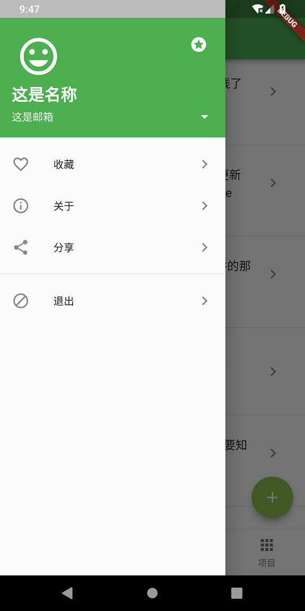
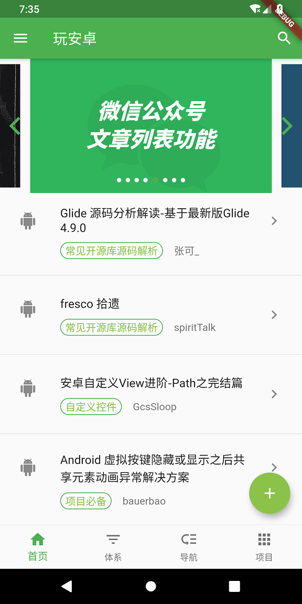
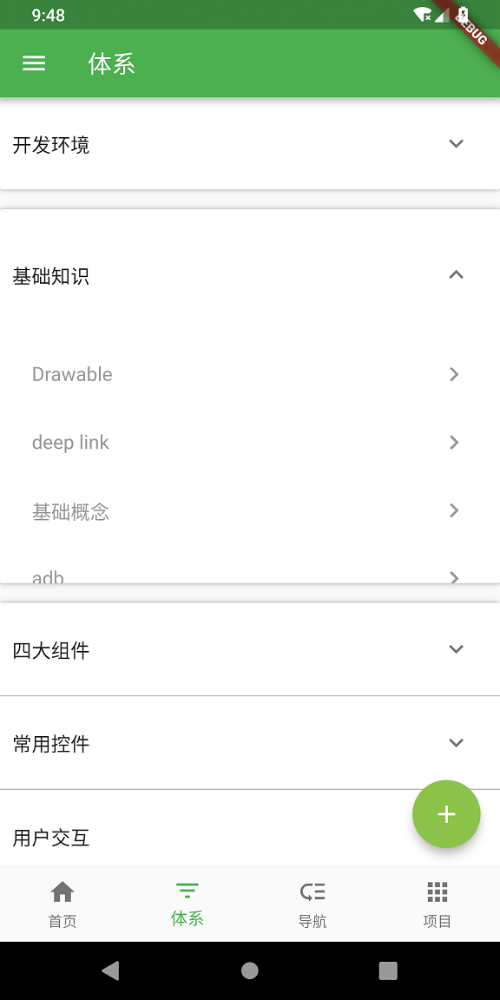
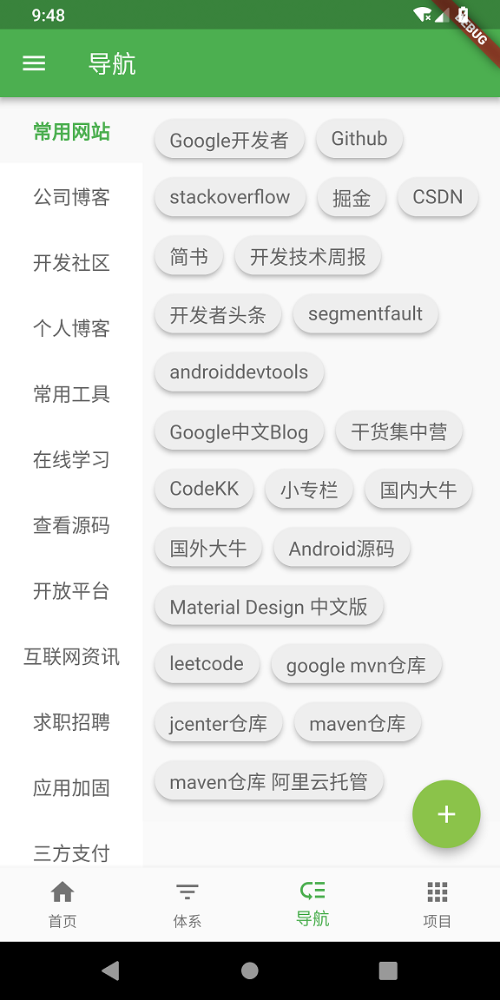
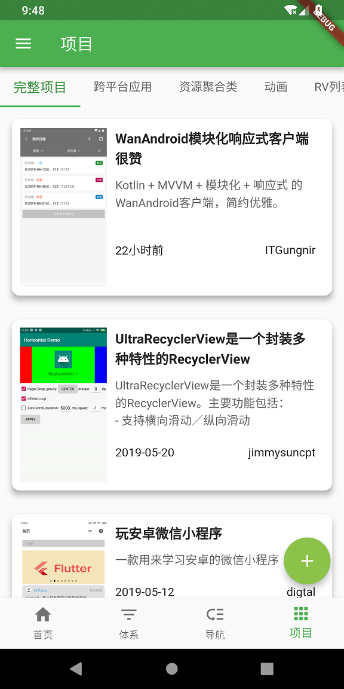

# wanandroid_flutter

玩安卓的`flutter`版本，首先感谢`鸿洋`提供的api，然后就是这个项目目前还在开发中，不过主体框架已经出来了，而且常用的`widget`也基本都用到了，后面会继续开发并完善。


<br>

## 兄dei 随手点个star支持一下呗

<br>

先截几个图稍微看下效果：

  

  

 


<br>

## 涉及到的知识点
* [BottomNavigationBar](https://blog.csdn.net/yechaoa/article/details/89880284)
* [FlutterJsonBeanFactory](https://blog.csdn.net/yechaoa/article/details/90035254)
* [加载WebView](https://blog.csdn.net/yechaoa/article/details/90175271)
* [网络请求](https://blog.csdn.net/yechaoa/article/details/90234708)
* [ExpansionPanelList](https://blog.csdn.net/yechaoa/article/details/90376584)
* [Wrap](https://blog.csdn.net/yechaoa/article/details/90403760)
* [Chip](https://blog.csdn.net/yechaoa/article/details/90405997)
* [TabBar](https://blog.csdn.net/yechaoa/article/details/90482127)
* [Card](https://blog.csdn.net/yechaoa/article/details/90483097)
* [banner](https://blog.csdn.net/yechaoa/article/details/90643476)
* [Drawer](https://blog.csdn.net/yechaoa/article/details/90607772)
* [SliverAppBar](https://blog.csdn.net/yechaoa/article/details/90701321)
* [PopupMenuButton](https://blog.csdn.net/yechaoa/article/details/90704165)


## todo

- ~~登录~~
- ~~注册~~
- ~~退出~~
- 收藏
- 分享
- 搜索
- 分页
- 体系列表点击
- 界面美化
- 切换主题
- 添加字体


## 感谢
* [fluttertoast](https://github.com/PonnamKarthik/FlutterToast)
* [dio](https://github.com/flutterchina/dio)
* [cookie_jar](https://github.com/flutterchina/cookie_jar)
* [flutter_webview_plugin](https://pub.dev/packages/flutter_webview_plugin#-readme-tab)
* [flutter_swiper](https://github.com/best-flutter/flutter_swiper)


<br>


```
   Copyright [2019] [yechaoa]

   Licensed under the Apache License, Version 2.0 (the "License");
   you may not use this file except in compliance with the License.
   You may obtain a copy of the License at

       http://www.apache.org/licenses/LICENSE-2.0

   Unless required by applicable law or agreed to in writing, software
   distributed under the License is distributed on an "AS IS" BASIS,
   WITHOUT WARRANTIES OR CONDITIONS OF ANY KIND, either express or implied.
   See the License for the specific language governing permissions and
   limitations under the License.
```
